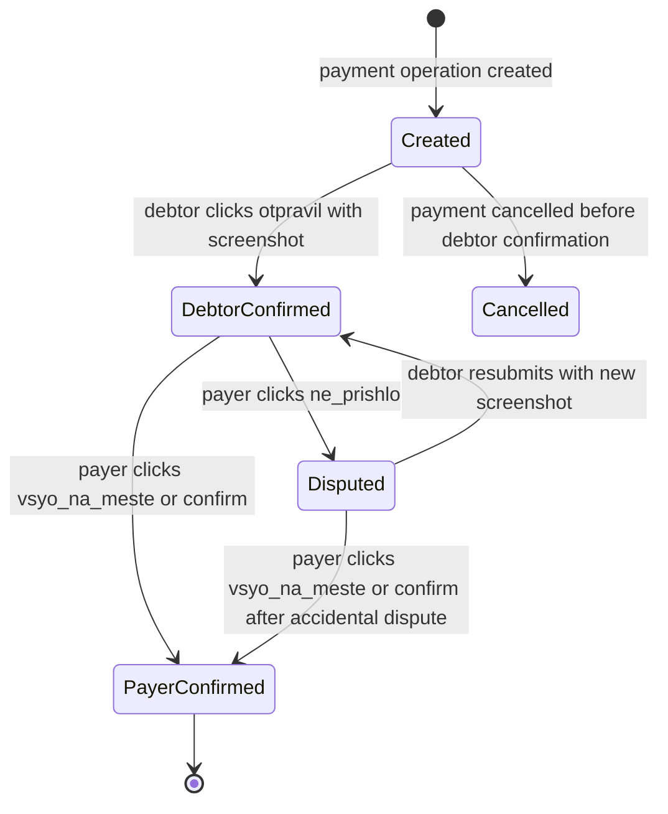

# Payment Flow

## Purpose

Документ описывает жизненный цикл оплаты долга через ручной перевод по реквизитам плательщика в MVP.

## Context

После выбора позиций и расчета долей система создает долги между участниками. В MVP плательщик указывает свои реквизиты для перевода, должник переводит деньги вне системы, прикрепляет скрин перевода и подтверждает действие «Отправил» в Mini App. Плательщик подтверждает получение массово («Всё на месте») или точечно («Подтвердить» / «Не пришло»). Долг закрывается после подтверждения плательщика.

## Responsibilities

- Описать путь от рассчитанного долга до закрытия долга.
- Зафиксировать роль модулей `debts` и `payments`.
- Определить минимальные платежные статусы MVP.
- Обозначить границы ответственности backend при ручном переводе.
- Зафиксировать модель «скрин перевода + ленивое подтверждение плательщика».
- Зафиксировать двухстороннее подтверждение оплаты с массовым действием плательщика.
- Отделить MVP-сценарий от будущей СБП-интеграции.

## Non Responsibilities

- Документ не описывает банковский API.
- Документ не создает платежные endpoints.
- Документ не гарантирует автоматическое подтверждение перевода на MVP.
- Документ не описывает бухгалтерский учет.
- Документ не заменяет бизнес-правила расчета долгов.

## Design Decisions

Поток MVP:

1. `debts` рассчитывает долг после финализации выбора позиций.
2. Пользователь открывает долг в Mini App.
3. `payments` создает платежную операцию для конкретного долга.
4. Должник нажимает **Скинуть** (backend: `перевести`) и видит сумму, получателя и реквизиты из профиля плательщика.
5. Должник переводит деньги вне системы.
6. Должник прикрепляет скрин перевода и нажимает **Отправил** (backend: `перевел`).
7. `payments` фиксирует подтверждение со стороны должника, сохраняет скрин в `files` и переводит платеж в состояние `debtor_confirmed`.
8. Статус долга меняется на `ожидает подтверждения` (UI: **Ждёт проверки**).
9. Плательщик проверяет поступление денег вне системы (может просмотреть скрин в Mini App).
10. Плательщик нажимает **Всё на месте** (bulk confirm) или **Подтвердить** по конкретному участнику (backend: `получил`).
11. Альтернатива: плательщик нажимает **Не пришло** → платеж переходит в `disputed`; бот уведомляет должника.
12. `payments` переводит платежную операцию в статус `payer_confirmed` (или остаётся `disputed`).
13. `debts` закрывает долг; статус долга — `оплачено` (UI: **Подтверждено**).
14. Когда все долги сбора подтверждены, плательщик вручную закрывает сбор (`POST /events/{id}/close`) → `events` переводит сбор в `COMPLETED` (UI: **Закрыт**).

Маппинг статусов долга, платежа и UI:

| UI | Статус долга | Статус платежа | Условие |
| --- | --- | --- | --- |
| **Не скинул** | `не оплачено` | нет платежа или `created` | Долг рассчитан, оплата не начата |
| **Ждёт проверки** | `ожидает подтверждения` | `debtor_confirmed` | Должник нажал «Отправил» и приложил скрин |
| **Подтверждено** | `оплачено` | `payer_confirmed` | Плательщик подтвердил («Всё на месте» или индивидуально) |
| **Не пришло** | `ожидает подтверждения` | `disputed` | Плательщик оспорил перевод |

Для MVP базовая модель поддерживает состояния платежа: `created`, `debtor_confirmed`, `payer_confirmed`, `cancelled`, `disputed`.

### Скрин перевода

- Обязателен для перехода в `debtor_confirmed` на MVP.
- Хранится в модуле `files`; `Payment` содержит ссылку на `fileId`.
- Доступен для просмотра плательщику и должнику по данному долгу.
- Не логируется и не отображается в групповом чате.

## State Machine

Состояния debt и payment связаны, но не идентичны:

- Debt отвечает на вопрос: «закрыто ли финансовое обязательство?».
- Payment отвечает на вопрос: «на каком этапе подтверждения находится попытка оплаты?».

Такое разделение нужно, потому что post-MVP СБП добавит больше платежных статусов, но debt lifecycle должен остаться понятным пользователю.

## Module Responsibilities In Flow

| Шаг | Module | Responsibility |
| --- | --- | --- |
| Расчет суммы | `debts` | Создать `Debt` с amount и status `UNPAID` |
| Просмотр реквизитов | `payments` + `users` | Получить реквизиты из профиля плательщика |
| Подтверждение должника | `payments` | Зафиксировать `DEBTOR_CONFIRMED`, сохранить скрин в `files` |
| Bulk confirm плательщика | `payments` | Подтвердить все `debtor_confirmed` одним вызовом → `PAYER_CONFIRMED` |
| Оспаривание | `payments` | Перевести в `DISPUTED`, уведомить должника |
| Изменение debt status | `debts` | Перевести debt в `PENDING_CONFIRMATION` через public contract |
| Подтверждение плательщика | `payments` | Зафиксировать `PAYER_CONFIRMED` (индивидуально или bulk) |
| Закрытие долга | `debts` | Перевести debt в `PAID` |
| Закрытие сбора | `events` | Перевести event в `COMPLETED` когда все долги `PAID` |
| Уведомление | `notifications` | Сообщить второй стороне о переходе статуса |

`payments` не рассчитывает сумму долга. `debts` не хранит реквизиты и не знает, как пользователь подтверждал платеж.

## Idempotency And Error Handling

| Operation | Idempotency Rule | Error Cases |
| --- | --- | --- |
| Create payment for debt | Повторный вызов возвращает существующий active payment | Debt not found, requester not participant, debt already paid |
| View details (`перевести`) | Read-only, всегда idempotent | Плательщик не указал реквизиты |
| Debtor confirm (`перевел` / «Отправил») | Повторный confirm тем же должником возвращает current state | Requester is not debtor, payment already paid/cancelled, screenshot missing |
| Payer confirm (`получил` / «Подтвердить») | Повторный confirm плательщиком возвращает paid state | Requester is not payer, payment not in `debtor_confirmed` or `disputed` |
| Payer bulk confirm («Всё на месте») | Подтверждает все `debtor_confirmed` и `disputed` для сбора; idempotent | Requester is not payer, no pending payments |
| Dispute («Не пришло») | Переводит в `disputed`; повторный dispute idempotent | Requester is not payer, payment not in `debtor_confirmed` |
| Cancel | Допустим только до debtor confirm | Payment already confirmed or disputed |

Ошибки состояния должны быть доменными ошибками (`409 Conflict` или бизнес-ошибка), а не generic `500`.

## Security Notes

- Должник видит реквизиты только для своего долга.
- Плательщик видит подтверждения только по долгам, где он является creditor.
- Участник чужого мероприятия не может открыть payment details.
- Реквизиты не логируются.
- Payment confirmation endpoints требуют JWT и authorization check.

## Future SBP Mapping

При переходе к СБП ручные статусы маппятся так:

| Manual MVP | SBP Future |
| --- | --- |
| `created` | `initiated` |
| `debtor_confirmed` | `pending_bank_confirmation` |
| `payer_confirmed` | `completed` |
| `disputed` | `failed` или `manual_review` |

Ручной сценарий должен остаться fallback, если банк недоступен или пользователь хочет перевести другим способом.

## Constraints

- Нельзя помечать долг закрытым только по нажатию должника «Отправил».
- Нельзя помечать долг закрытым без подтверждения плательщика («Всё на месте» или индивидуально).
- Скрин перевода обязателен для `debtor_confirmed` на MVP.
- Нельзя смешивать расчет долга и платежную логику в одном модуле.
- Нельзя хранить чувствительные платежные данные сверх необходимости MVP.
- Все операции оплаты должны быть связаны с конкретным долгом.
- Повторное создание платежа по одному долгу должно быть защищено от дублей или явно описано как допустимое.
- Спорные статусы должны быть видимы пользователям, а не скрыты внутренней логикой.
- Реквизиты плательщика должны храниться только в объеме, достаточном для перевода между участниками.

## Future Evolution

- Переход к СБП как основному платежному сценарию.
- Автоматическая сверка платежей через полноценную СБП-интеграцию.
- Частичные платежи и перерасчет остатка.
- Поддержка нескольких способов оплаты.
- Soft auto-confirm через 48 ч при наличии скрина и отсутствии спора (post-MVP).
- Payment events для уведомлений, аудита и будущей Kafka-интеграции.
- Выделение `payments` в отдельный сервис при росте требований к надежности и compliance.

## Related Documents

- `docs/product/ux-checklist.md`
- `docs/business/business-rules.md`
- `docs/modules/debts.md`
- `docs/modules/payments.md`
- `docs/integrations/sbp.md`
- `docs/security/api-security.md`
- `docs/adr/ADR-0007-manual-payment-first.md`
