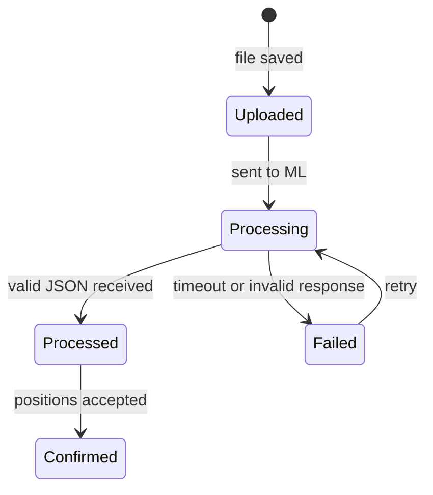

# Receipt Processing Flow

## Purpose

Документ описывает обработку чека в backend после получения изображения и структурированного JSON от Python ML-сервиса. В MVP чек является способом автоматического заполнения позиций, а не обязательным условием создания мероприятия.

## Context

В MVP backend не выполняет OCR. Пользователь может добавить позиции вручную или загрузить чек. Если чек загружен, изображение передается в ML-контур или файловое хранилище, Python-сервис возвращает структурированный JSON. Backend отвечает за проверку этого JSON, нормализацию значений и создание позиций мероприятия.

## Responsibilities

- Описать границу между OCR/ML и backend.
- Зафиксировать обработку структурированного JSON чека.
- Зафиксировать, что ручные позиции не зависят от ML-сервиса.
- Определить роль модулей `files`, `receipts`, `events` и `debts`.
- Описать обработку ошибок распознавания.
- Сохранить MVP-подход без асинхронной очереди на старте, если синхронный flow достаточен.

## Non Responsibilities

- Backend не распознает текст на изображении.
- Backend не обучает и не выбирает ML-модель.
- Документ не описывает конкретный JSON schema в деталях.
- Документ не создает таблицы чеков или позиций.
- Документ не определяет UI выбора позиций.

## Design Decisions

Поток MVP:

1. Пользователь создает мероприятие.
2. Пользователь может добавить позиции вручную: название, количество, общая цена.
3. Пользователь может загрузить изображение чека как дополнительный способ заполнения позиций.
4. `files` сохраняет файл или ссылку на файл.
5. Backend инициирует обработку через `integrations` adapter для Python ML-сервиса.
6. Python ML-сервис возвращает структурированный JSON.
7. `receipts` валидирует обязательные поля: позиции, цены, количества, итоговые суммы, валюту или ее отсутствие.
8. `receipts` нормализует значения: деньги, количество, названия позиций, порядок строк, rounding.
9. `receipts` создает или предлагает позиции мероприятия из результата чека.
10. После окончательного формирования списка плательщик отправляет позиции на распределение.
11. Пользователи выбирают свои позиции.
12. После завершения выбора `debts` рассчитывает долги.

Ошибки ML-сервиса не должны автоматически становиться доменными ошибками чека. Если сервис не вернул пригодный JSON, чек должен перейти в состояние, требующее повторной обработки или ручного вмешательства, если такой сценарий входит в MVP.

## Receipt State Machine

На MVP `Confirmed` может быть не отдельным persisted status, если UI сразу показывает позиции для редактирования. Но бизнес-смысл должен быть сохранен: позиции из ML не должны считаться финальными, пока пользователь не завершил редактирование и не отправил мероприятие на распределение.

## Validation Pipeline

Backend обрабатывает результат ML-сервиса по шагам:

1. **Shape validation** — JSON имеет ожидаемые поля (`items`, `total`, `confidence`, `errors`).
2. **Required fields validation** — у каждой позиции есть `name`, `quantity`, `total_price`.
3. **Type validation** — цены и количества являются числами в допустимом диапазоне.
4. **Business validation** — сумма позиций согласуется с итогом, позиции не отрицательные.
5. **Normalization** — деньги переводятся в копейки, названия trim, quantity приводится к decimal.
6. **Domain creation** — создаются `Receipt` и `Position` в модуле `receipts`.
7. **User review** — пользователь может исправить позиции до распределения.

ML-сервис не возвращает backend id и не решает, какие позиции должны участвовать в долгах. Это решение остается за backend и пользователем.

## Confidence Handling

| Confidence | Backend Behavior | User Experience |
| --- | --- | --- |
| `>= 0.7` | Позиции создаются как обычные receipt positions | Пользователь может редактировать |
| `0.5 - 0.69` | Позиции создаются с low-confidence marker | UI должен подсветить необходимость проверки |
| `< 0.5` | Receipt остается failed/review-required | Пользователь добавляет позиции вручную или повторяет обработку |
| `null` | Treat as low confidence | Не доверять результату без проверки |

Confidence не влияет на право пользователя добавить позиции вручную.

## Error Taxonomy

| Error | Source | Result |
| --- | --- | --- |
| File too large | `files` | Reject upload |
| Unsupported MIME | `files` | Reject upload |
| ML timeout | `integrations` | Receipt `FAILED`, retry allowed |
| Invalid JSON shape | `receipts` | Receipt `FAILED`, raw response stored if safe |
| Empty items | `receipts` | Receipt `FAILED`, manual fallback |
| Total mismatch | `receipts` | Warning or failed depending threshold |
| Low confidence | ML result | Positions require review |

## Module Boundaries

- `files` сохраняет файл и metadata, но не знает о позициях.
- `integrations` вызывает ML-сервис, но не создает domain objects.
- `receipts` валидирует JSON и создает `Receipt`/`Position`.
- `events` контролирует, можно ли менять позиции в текущем статусе мероприятия.
- `debts` использует уже подтвержденные позиции и не читает raw ML JSON.

## Test Cases

Обязательные тесты:

- valid receipt JSON создает позиции с корректной суммой в копейках;
- receipt JSON без `items` не создает позиции;
- low confidence result помечается для проверки;
- ML timeout не блокирует ручное добавление позиций;
- position из чека можно отредактировать до отправки на распределение;
- долги нельзя рассчитать, если receipt positions еще не подтверждены пользователем.

## Constraints

- Backend принимает только структурированный JSON, а не сырой OCR-текст как источник бизнес-правды.
- Нельзя доверять суммам из ML-сервиса без backend-валидации.
- Нельзя блокировать ручное добавление позиций из-за недоступности ML-сервиса.
- Нельзя создавать долги до завершения выбора позиций.
- Нельзя скрывать низкую уверенность распознавания, если она влияет на корректность суммы.
- Для MVP не вводится Kafka, если синхронная обработка укладывается в приемлемые таймауты.
- Данные чека должны быть связаны с конкретным мероприятием и плательщиком.

## Future Evolution

- Асинхронная обработка чеков через очередь.
- Повторная обработка изображения другим ML-пайплайном.
- Хранение confidence по каждой позиции и использование его в UI.
- Редактирование позиций, созданных из распознанного чека.
- События `ReceiptProcessed`, `ReceiptFailed`, `ReceiptConfirmed` для уведомлений и аналитики.

## Related Documents

- `docs/modules/files.md`
- `docs/modules/receipts.md`
- `docs/modules/debts.md`
- `docs/integrations/ml-service.md`
- `docs/integrations/receipt-json-contract.md`
- `docs/ml/receipt-recognition.md`
- `docs/adr/ADR-0008-receipt-processing.md`
- `docs/adr/ADR-0009-python-ml-service.md`
