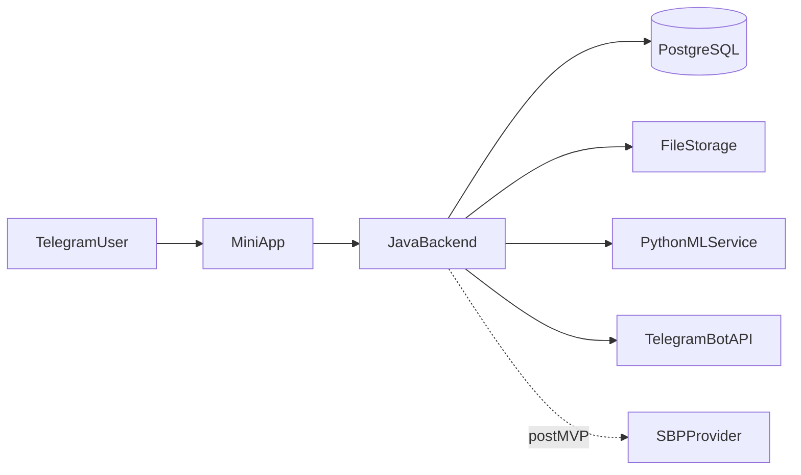

# System Overview

## Purpose

Документ описывает систему `skinemsya` целиком: границы backend, внешние участники, основные потоки данных и ограничения MVP.

## Context

Продукт представляет собой Telegram Mini App для разделения счетов внутри группы. В MVP есть два входа: через групповой Telegram-чат (автоматическое создание `CHAT_LINKED`-группы) и напрямую в Mini App (ручное создание `STANDALONE`-группы). При входе из чата bot закрепляет сообщение с кнопкой Mini App, а backend создает группу по данным чата или присоединяет пользователя к существующей группе. Внутри группы участники создают мероприятие, добавляют позиции вручную или через загрузку чека, выбирают свои позиции, после чего система рассчитывает долги и помогает закрыть их через перевод по реквизитам плательщика. СБП рассматривается как следующий этап развития платежного сценария.

Backend является центральной транзакционной системой. Он хранит пользователей, связь с Telegram-чатами, группы, мероприятия, позиции расходов, структурированные чеки, выбранные позиции, долги и платежные статусы. OCR и ML-распознавание не входят в ответственность backend: на MVP они выполняются отдельным Python-сервисом, который возвращает структурированный JSON для автоматического заполнения позиций.

## Responsibilities

- Принимать запросы от Telegram Mini App.
- Проверять Telegram-auth данные и выпускать backend JWT.
- Хранить транзакционные данные продукта в PostgreSQL.
- Связывать Telegram-чаты с `CHAT_LINKED`-группами.
- Поддерживать ручное создание `STANDALONE`-групп.
- Управлять группами, участниками и мероприятиями.
- Поддерживать ручное добавление и редактирование позиций.
- Валидировать и нормализовать структурированный JSON чека.
- Создавать доменные модели позиций, чеков, долгов и платежей.
- Координировать взаимодействие с Python ML-сервисом и файловым хранилищем.
- Хранить реквизиты плательщика, необходимые для ручного перевода в рамках MVP.
- Предоставлять OpenAPI-описание backend API.
- Поддерживать минимальную observability-базу: ошибки, логи, correlation id.

## Non Responsibilities

- Backend не выполняет OCR.
- Backend не обучает ML-модели.
- Backend не является платежным процессингом или банком.
- Backend не выполняет денежный перевод самостоятельно.
- Backend не гарантирует факт оплаты без подтверждения с двух сторон: должник отметил перевод, плательщик отметил получение.
- Backend не реализует микросервисную оркестрацию на MVP.
- Backend не использует Kafka или другую распределенную шину событий на MVP.
- Backend не хранит секреты в исходном коде.

## Design Decisions

- Система строится как модульный монолит, потому что MVP должен быть быстро разработан, просто протестирован и развернут одним backend-приложением.
- PostgreSQL используется как единый источник транзакционной правды, потому что домен содержит связанные данные с требованиями к целостности.
- Python ML-сервис отделяется от Java backend, потому что OCR/ML-стек технологически отличается от бизнес-backend и может развиваться независимо.
- Интеграции оформляются через отдельный integration-контур, чтобы доменные модули не зависели напрямую от внешних API.
- Событийная архитектура рассматривается как future evolution, но в MVP доменные изменения обрабатываются синхронно или через простые внутренние вызовы.

## System Actors

| Actor | Role In System | Trust Level |
| --- | --- | --- |
| Telegram user | Открывает Mini App, создает группы, выбирает позиции, подтверждает платежи | Authenticated after init data validation |
| Telegram Mini App frontend | UI-клиент backend API | Trusted only as bearer of user action, all rules rechecked backend-side |
| Telegram Bot | Доставляет entrypoint и уведомления | External integration, token-protected |
| Java backend | Транзакционная система и владелец бизнес-правил | Source of truth |
| PostgreSQL | Хранилище транзакционных данных | Source of persisted truth |
| Python ML-service | Распознает чек и возвращает JSON | Untrusted for business decisions; result must be validated |
| File storage | Хранит изображения чеков | Infrastructure dependency |
| SBP provider | Future payment provider | Not used in MVP |

## High-Level Data Flow

Основной backend path:

1. Mini App отправляет запрос с JWT.
2. `app` проверяет security chain.
3. Доменный module application service выполняет use case.
4. При необходимости вызывается public contract другого модуля.
5. Изменения сохраняются в PostgreSQL в рамках транзакции.
6. Side effects выполняются через `integrations` или internal events.

## Core Domain Invariants

Инварианты должны выполняться независимо от REST endpoint, UI-состояния или способа запуска операции:

- Пользователь не может видеть группу, если он не является `group_member`.
- `CHAT_LINKED`-группа имеет `telegramChatId`; `STANDALONE`-группа не имеет `telegramChatId`.
- Мероприятие не может существовать вне группы.
- Плательщик мероприятия должен быть участником группы.
- Позиция не может существовать вне мероприятия.
- Чек не является обязательным источником позиций.
- Долг не рассчитывается, пока позиции не отправлены на распределение и выбор не завершен.
- Плательщик не должен иметь долг перед самим собой.
- Долг не закрывается после действия должника `перевел`; требуется действие плательщика `получил`.
- Реквизиты для ручного перевода хранятся в профиле пользователя, а не в мероприятии.
- Telegram username не используется как устойчивый идентификатор.

## MVP Runtime Shape

В MVP система разворачивается как:

- один Java backend artifact;
- одна PostgreSQL database;
- один опциональный Python ML-service;
- локальное или S3-compatible файловое хранилище;
- Telegram Bot API как внешняя интеграция.

Отсутствуют:

- API Gateway;
- Kafka/RabbitMQ;
- service discovery;
- distributed tracing stack;
- отдельные БД на модуль;
- банковская платежная интеграция.

Такой runtime выбран, чтобы первая версия могла быть разработана и задеплоена небольшой командой без отдельной platform-команды.

## AI Orientation Notes

Для AI-агента этот документ должен отвечать на вопрос: «Какая система строится целиком?». После чтения агент должен понимать:

- почему монолит является намеренным решением, а не временной случайностью;
- почему модулей много, хотя deploy один;
- почему ML вынесен отдельно, но backend остается владельцем бизнес-валидности;
- почему платежи на MVP ручные;
- почему `CHAT_LINKED` и `STANDALONE` группы являются равноправными MVP-сценариями.

Если агент собирается предложить микросервис, очередь, СБП или сложную роль, он должен сначала найти документ, который переводит эту идею из Future Evolution в MVP scope. Если такого документа нет, предложение считается выходом за рамки MVP.

## Constraints

- MVP оптимизируется по скорости вывода продукта на рынок.
- Допустима только инфраструктура, которая явно нужна для основного сценария.
- Все критичные бизнес-данные должны быть восстановимы из PostgreSQL.
- Внешние интеграции должны иметь таймауты и понятные ошибки.
- Решения не должны требовать отдельной команды DevOps для поддержки MVP.
- Документация должна оставаться источником истины для будущей реализации.

## Future Evolution

- Выделение ML-сервиса в асинхронный контур с очередью после роста нагрузки.
- Переход части доменных событий в Kafka при появлении независимых потребителей.
- Выделение `payments`, `notifications` или `receipts` в отдельные сервисы при наличии доказанной нагрузки или организационной необходимости.
- Добавление полноценного audit/event log после появления требований к расследованию спорных операций.

## Related Documents

- `docs/architecture/backend-architecture.md`
- `docs/architecture/module-dependencies.md`
- `docs/architecture/request-flow.md`
- `docs/architecture/receipt-processing-flow.md`
- `docs/architecture/payment-flow.md`
- `docs/business/mvp-scope.md`
- `docs/integrations/telegram.md`
- `docs/integrations/ml-service.md`
- `docs/integrations/sbp.md`
