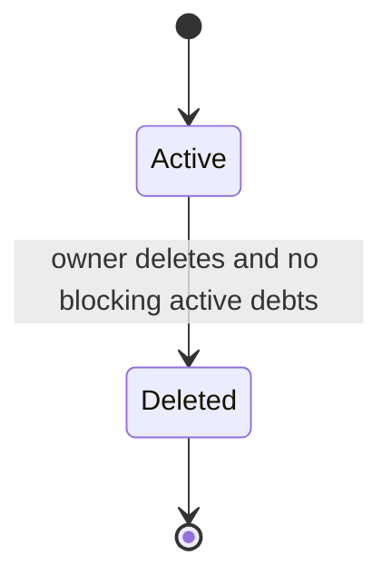
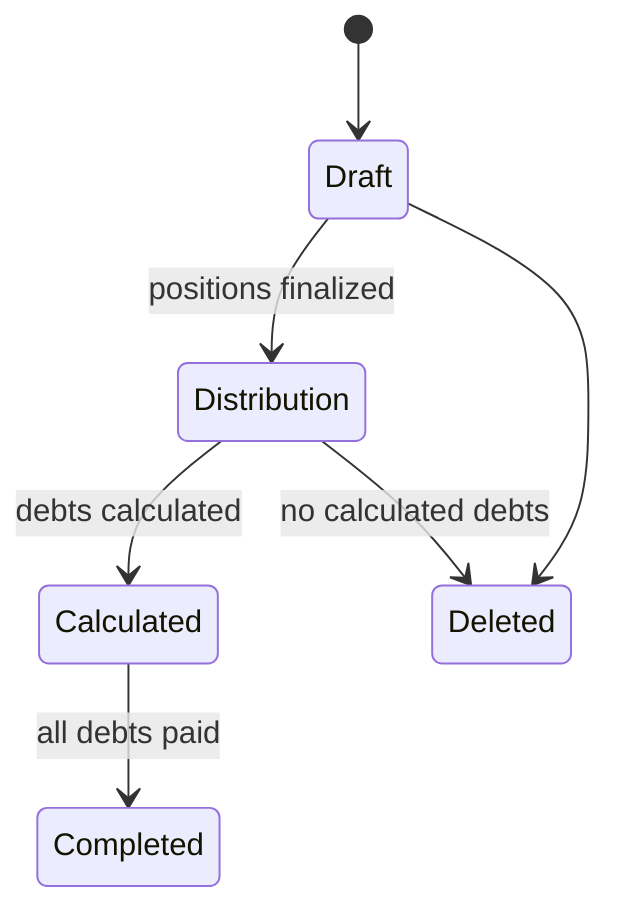
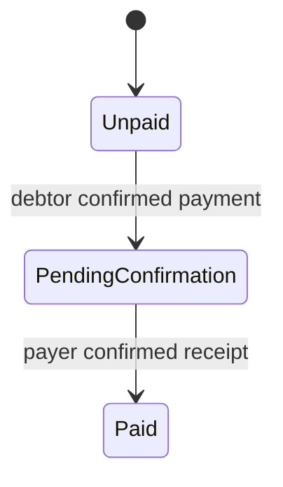

# Domain Model

## Purpose

Документ описывает бизнес-домен `skinemsya`: основные сущности, их смысл и связи на уровне предметной области.

## Context

Пользовательский сценарий MVP строится вокруг Telegram-чата, группы в приложении, мероприятия, позиций расходов, выбора позиций, расчета долгов и подтверждения оплаты. Чек является способом автоматического заполнения позиций, но ручное добавление позиций является базовым сценарием и не зависит от OCR.

## Responsibilities

- Описать основные доменные объекты.
- Определить владение объектами на бизнес-уровне.
- Показать связи между пользователями, группами, мероприятиями, чеками, долгами и платежами.
- Дать основу для модульной и database-документации.

## Non Responsibilities

- Документ не определяет entity classes.
- Документ не описывает DTO, REST API или SQL-таблицы.
- Документ не фиксирует все поля объектов.
- Документ не заменяет ERD.

## Design Decisions

Основные доменные объекты MVP:

| Объект | Назначение | Ключевые связи |
| --- | --- | --- |
| Пользователь | Участник системы, связанный с Telegram identity. | Может состоять в группах, участвовать в мероприятиях, быть плательщиком или должником. |
| Профиль пользователя | Настройки пользователя для участия в расчетах. | Связан с пользователем, содержит реквизиты, телефон и настройки уведомлений. |
| Telegram-чат | Групповой чат, куда добавлен bot. | Может быть связан с одной `CHAT_LINKED`-группой. Для `STANDALONE`-групп отсутствует. |
| Группа | Контейнер для совместных мероприятий. | Тип `CHAT_LINKED` (из Telegram-чата) или `STANDALONE` (создана вручную). Содержит участников. |
| Участник группы | Связь пользователя и группы. | Определяет доступ пользователя к мероприятиям группы. |
| Мероприятие | Конкретный совместный расход внутри группы. | Принадлежит группе, имеет участников, плательщика, позиции и долги. |
| Чек | Опциональный источник автоматического создания позиций. | Принадлежит мероприятию, связан с файлом и распознанными позициями. |
| Позиция | Строка расхода, которую могут выбрать участники. | Принадлежит мероприятию, может быть создана вручную или из чека, может быть распределена между одним или несколькими участниками. |
| Выбор позиции | Факт выбора участником позиции или доли позиции. | Используется для расчета долгов. |
| Долг | Обязательство одного участника заплатить сумму получателю. | Возникает из мероприятия и выбранных позиций. |
| Реквизиты плательщика | Данные для ручного перевода. | Хранятся в профиле пользователя; используются должником при оплате долга. |
| Платеж | Состояние закрытия долга. | Связан с долгом, подтверждением должника и подтверждением плательщика. |

Связи домена:

- Группа содержит участников.
- `CHAT_LINKED`-группа связана с одним Telegram-чатом; `STANDALONE`-группа не имеет привязки к чату.
- Мероприятие создается внутри группы.
- Участник мероприятия должен быть участником группы.
- Чек относится к одному мероприятию, но мероприятие может иметь позиции без чека.
- Позиция относится к одному мероприятию.
- Долг относится к одному мероприятию и одному должнику.
- Платеж относится к одному долгу.

## Aggregate Boundaries

Документ не фиксирует Java-классы, но задает бизнес-границы агрегатов для будущей реализации:

| Aggregate | Root | Внутренние объекты | Внешние ссылки |
| --- | --- | --- | --- |
| User Profile | `User` | `UserProfile`, `TelegramIdentity` | Нет |
| Group | `Group` | `GroupMember` | `User.id` |
| Event | `Event` | `EventParticipant` | `Group.id`, `User.id` (payer) |
| Receipt/Positions | `Receipt` или `Position` | `PositionSelection`, `SharedPositionTarget` | `Event.id`, `User.id`, `File.id` |
| Debt | `Debt` | Нет | `Event.id`, debtor `User.id`, creditor `User.id` |
| Payment | `Payment` | Payment confirmations | `Debt.id` |
| File | `StoredFile` | Нет | owner `User.id` |
| Notification | `Notification` | Нет | recipient `User.id` |

Практическое следствие: если код меняет внутренний объект агрегата, он должен проходить через module owner. Например, выбор позиции изменяет `receipts` aggregate, а не `events` или `debts`.

## Entity Lifecycle Overview

### Group

`CHAT_LINKED` group создается из Telegram chat context. `STANDALONE` group создается вручную. Оба типа после создания имеют одинаковый lifecycle.

### Event

Статус мероприятия отражает бизнес-готовность, а не UI-экран. Frontend может иметь несколько экранов, но backend state transitions должны оставаться минимальными.

### Debt And Payment

Payment — отдельный объект, потому что он хранит действия сторон и может развиваться в сторону СБП. Debt — результат расчета и финансовое обязательство.

## Identity Rules

- `User.id` — внутренний ключ для доменных связей.
- `telegram_user_id` — external identity, уникален, но не используется как FK между доменными объектами.
- `telegram_chat_id` — external identity для `CHAT_LINKED` group, nullable для `STANDALONE`.
- `username` — display data only; нельзя использовать для поиска участника как единственный идентификатор.

## Money Rules

- Деньги хранятся в минимальных денежных единицах (`kopecks`) или через точный decimal на уровне домена.
- Floating point (`float`, `double`) запрещен для расчетов.
- Все округления должны быть deterministic.
- JSON от ML-сервиса может содержать decimal values, но backend нормализует их перед доменной логикой.

## Constraints

- Пользователь не должен участвовать в мероприятии вне группы, к которой у него нет доступа.
- Чат не должен автоматически давать доступ к группе без входа пользователя в Mini App и проверки Telegram identity.
- Чек не должен существовать без мероприятия, но мероприятие может существовать без чека.
- Позиция должна иметь название, количество и общую цену.
- Долг не должен рассчитываться до завершения выбора позиций.
- Долг не должен закрываться без подтверждения плательщика.
- Telegram user id не должен быть основной доменной связью между объектами.
- Платеж MVP не должен требовать банковской интеграции.

## Future Evolution

- Роли внутри группы: владелец, администратор, участник.
- Частичные долги и частичные платежи.
- Несколько чеков в одном мероприятии.
- Несколько плательщиков в одном мероприятии.
- Расширенное редактирование группы, мероприятия и позиций.
- Доменные события для расчетов, уведомлений, платежей и аудита.

## Related Documents

- `docs/business/glossary.md`
- `docs/business/business-rules.md`
- `docs/business/use-cases.md`
- `docs/database/entity-relations.md`
- `docs/modules/*.md`
