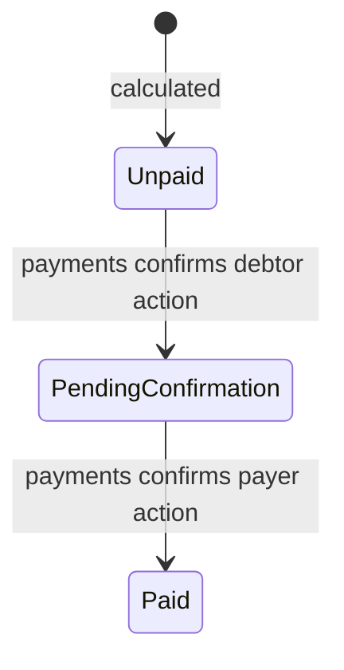

# Module: debts

## Purpose

Модуль `debts` рассчитывает долги между участниками мероприятия и управляет статусами задолженности.

## Responsibilities

- Расчет долгов после завершения выбора позиций.
- Детерминированное округление сумм.
- Управление статусами долга: `не оплачено`, `ожидает подтверждения`, `оплачено`.
- Закрытие долга после подтверждения плательщика (через `payments`).
- Предоставление статистики «кто кому должен».

## Domain Objects

- `Debt` — долг: `id`, `eventId`, `debtorId`, `creditorId` (плательщик), `amount`, `status`.
- `DebtStatus` — enum: `UNPAID`, `PENDING_CONFIRMATION`, `PAID`.
- `DebtSummary` — агрегированная статистика для главного экрана.

## Dependencies

- `events` — мероприятие, плательщик, статус.
- `receipts` — выбранные позиции и доли.
- `users` — участники.
- `common` — Money, ошибки.

## Events

- `DebtsCalculated` — долги рассчитаны для мероприятия.
- `DebtClosed` — долг закрыт после подтверждения плательщика.

## Database Objects

- `debts` — id, event_id (FK), debtor_id (FK users), creditor_id (FK users), amount_kopecks, status, created_at, updated_at.
- Index: (event_id), (debtor_id), (creditor_id), (status).

## Public Contracts

- `DebtService.calculate(eventId)` → `List<Debt>`
- `DebtService.findByEvent(eventId)` → `List<Debt>`
- `DebtService.findByUser(userId)` → `List<Debt>`
- `DebtService.getSummary(userId)` → `DebtSummary`
- `DebtService.close(debtId)` → `Debt` (вызывается из `payments`)
- REST: `GET /api/v1/events/{eventId}/debts`, `GET /api/v1/debts/summary`

## Calculation Model

MVP calculation works with final positions and selections:

1. `events` provides event participants and payer.
2. `receipts` provides positions and selected users per position.
3. For each position, determine target users:
   - if position is selected by users, split between selected users;
   - if position is marked shared for all, split between all event participants;
   - if position is shared for selected group, split between listed target users.
4. For each user share, if user is not payer, add amount to debt from user → payer.
5. Aggregate all shares by `(debtorId, creditorId)`.
6. Persist one `Debt` per debtor/creditor/event with amount > 0.

The module does not know if a position came from manual input or receipt after `receipts` has accepted it. Source may remain for audit/UI, not for calculation differences.

## Rounding Rules

Money is calculated in kopecks. When splitting an amount that is not divisible by participant count:

1. Calculate `baseShare = amount / count`.
2. Calculate `remainder = amount % count`.
3. Sort target users by stable key (`userId` ascending).
4. Give +1 kopeck to the first `remainder` users.

This rule ensures repeatable results in tests and production.

Example:

| Amount | Users | Shares |
| --- | --- | --- |
| 100 kopecks | 3 | 34, 33, 33 |
| 101 kopecks | 2 | 51, 50 |
| 999 kopecks | 4 | 250, 250, 250, 249 |

## State Transitions

Only `payments` should trigger `PendingConfirmation` and `Paid` transitions via public contract calls. `debts` owns persistence and validation of the transition.

## Error Cases

| Condition | Error |
| --- | --- |
| Event not found | `EVENT_NOT_FOUND` |
| Event not ready for calculation | `EVENT_NOT_READY_FOR_DEBT_CALCULATION` |
| No positions | `NO_POSITIONS_FOR_CALCULATION` |
| Position has no selected/shared targets | `POSITION_HAS_NO_TARGETS` |
| Payer not event participant | `PAYER_NOT_EVENT_PARTICIPANT` |
| Debt already paid and recalculation requested | `DEBT_RECALCULATION_BLOCKED` |

## AI Implementation Notes

Do not implement debt calculation in `receipts`, `events` or `payments`. Those modules provide input or consume results. If an endpoint calculates debts, it still calls `DebtService.calculate(eventId)`.

Do not use floating point. Use `long` kopecks or `BigDecimal` only at boundaries before normalization.

## Future Extensions

- Перерасчет при изменении позиций.
- Частичные долги.
- Несколько кредиторов.
- Экспорт долгов.
