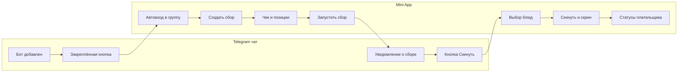
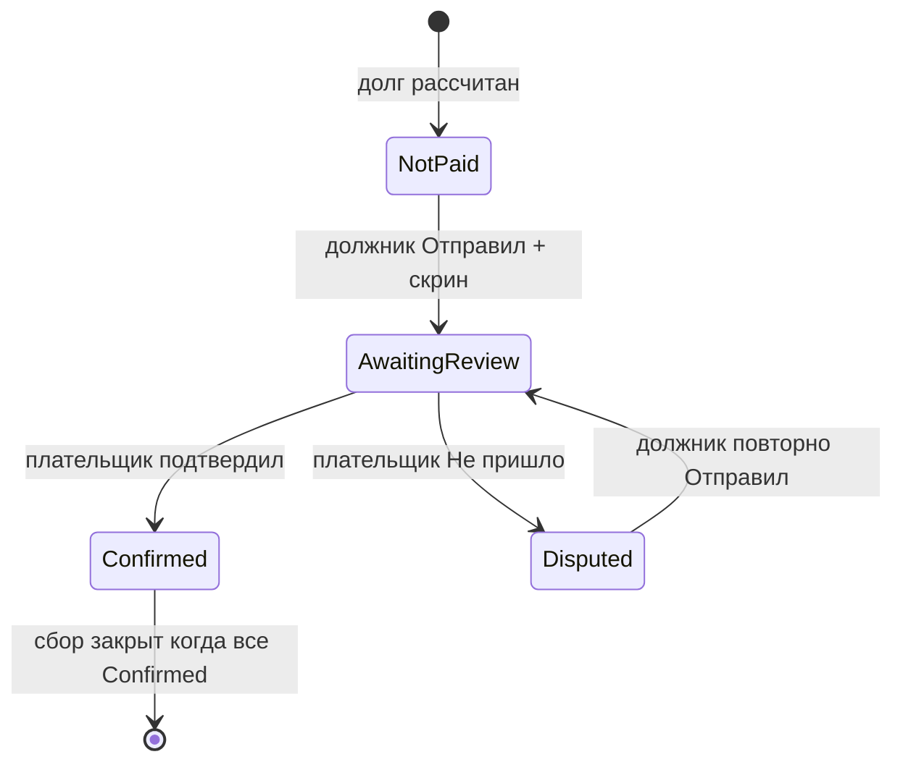

# UX Checklist

## Purpose

Документ фиксирует продуктовую спецификацию и UX-чеклист MVP `skinemsya`: принципы простоты, happy path, терминологию UI, карту экранов, модель подтверждения оплат и чеклисты по ролям (BA, архитектор, дизайнер, разработка).

## Context

Целевая аудитория — люди, которые делят счёт после совместного ужина, бара или поездки. Продукт должен работать в состоянии усталости и без инструкций: минимум нажатий у плательщика, максимум автоматизации при входе из Telegram-чата.

Backend-документация описывает доменные сущности и API; этот документ — единый источник правды для UX, microcopy и продуктовых решений. Технические термины backend (`Event`, `Position`, `Debt`) в коде не меняются; в UI используется разговорный язык.

## Responsibilities

- Зафиксировать продуктовые принципы и критерии «пьяного теста».
- Описать happy path из 10 шагов с деталями по экранам.
- Предложить UI-терминологию и связать её с backend-терминами.
- Описать модель подтверждения оплат: скрин перевода + простое действие плательщика.
- Дать чеклисты по ролям с чекбоксами для реализации MVP.
- Зафиксировать UX-улучшения, edge cases и синхронизацию с backend docs.

## Non Responsibilities

- Документ не содержит pixel-perfect макеты Figma.
- Документ не описывает REST API контракты (см. module docs).
- Документ не заменяет `business-rules.md` и `use-cases.md`.
- Документ не задаёт изменения кода напрямую.

## Design Decisions

### Продуктовые принципы

| Принцип | Критерий проверки |
| --- | --- |
| **Пьяный тест** | Любой шаг понятен без чтения инструкций; не больше 3 осмысленных действий на экран |
| **Минимум нажатий плательщика** | Плательщик создаёт сбор и ждёт; подтверждение — максимум 1–2 действия на весь сбор, не N раз по участникам |
| **Ноль настройки** | Вход из чата = группа готова; создатель сбора = плательщик по умолчанию |
| **Ошибки не блокируют** | Плохой ML-парсинг → ручное добавление на том же экране, без тупика |
| **Чат как навигация** | Каждое важное событие → сообщение в группу с deep link в нужный экран |

### Терминология UI

Внутри backend оставляем `Event`, `Position`, `Debt`, `sendToDistribution`. В UI и чат-боте:

| Backend (не менять) | Было в docs | UI / чат-бот | Почему |
| --- | --- | --- | --- |
| `Event` | Мероприятие | **Сбор** | «Создать сбор» — естественнее после ужина/бара |
| `sendToDistribution` | Отправить на распределение | **Запустить сбор** | Одно действие, понятный результат |
| `перевести` | Перевести | **Скинуть** | Язык целевой аудитории |
| `перевел` | Перевел | **Отправил** | Финальное подтверждение + прикрепление скрина |
| `получил` | Получил | **Подтвердить** / **Всё на месте** | Меньше бюрократии |
| `не оплачено` | Не оплачено | **Не скинул** | Единый язык с кнопкой |
| `ожидает подтверждения` | Ожидает подтверждения | **Ждёт проверки** | Плательщик «проверяет», не «подтверждает каждого» |
| `оплачено` | Оплачено | **Подтверждено** | Единый язык на экране плательщика |
| `Position` | Позиция | **Позиция** (редактирование) / **Блюдо** (выбор участником) | Контекстный язык |
| `DISTRIBUTION` | Распределение | **Выбирают** | Статус на карточке сбора |
| `DRAFT` | Черновик | **Готовится** | Понятнее для пользователя |
| `COMPLETED` | Завершено | **Закрыт** | «Сбор закрыт» |

Полная таблица UI ↔ backend — в `docs/business/glossary.md`.

### Общая схема потока

### Happy path: 10 шагов

#### Шаг 1–2: Вход через чат

1. В групповой чат добавляется бот с правами администратора.
2. Бот отправляет welcome-сообщение и закрепляет кнопку **«Открыть Skinemsya»**.
3. Пользователь открывает Mini App — backend создаёт или присоединяет к `CHAT_LINKED`-группе.

**UX-детали:**
- В welcome явно: «Откройте приложение один раз — вы автоматически в группе».
- Закреплённое сообщение всегда доступно как точка входа.

**Ограничение MVP:** полная синхронизация всех участников чата без открытия Mini App невозможна. Участники, не открывавшие приложение, отображаются как «Ещё не зашёл» (серый аватар); плательщик может нажать **«Напомнить»** → бот пишет в группу.

**Acceptance criteria:**
- [ ] Бот отправляет welcome при добавлении в группу.
- [ ] Закреплённая кнопка открывает Mini App с контекстом чата (`startapp=chat_{chatId}`).
- [ ] Первый вход создаёт группу; повторный вход присоединяет к существующей.
- [ ] Участник, не открывавший Mini App, виден в списке с особым статусом.

#### Шаг 3: Создание сбора

**Экран «Новый сбор»:**
- Название: автозаполнение из названия чата + дата (редактируемо).
- Плательщик: создатель выбран по умолчанию; смена — один тап на аватар.
- Описание скрыто под «Добавить заметку».

**Acceptance criteria:**
- [ ] Создатель = плательщик по умолчанию.
- [ ] Плательщика можно сменить до запуска сбора.
- [ ] Не более 2 обязательных полей на экране.

#### Шаг 4: Позиции и чек

**Экран «Список позиций» (статус сбора: Готовится):**
- Кнопки: **«Загрузить чек»** / **«Добавить вручную»** (системный picker: камера, галерея, файлы).
- После ML: карточки с названием, количеством, общей ценой, ценой за штуку (если qty > 1).
- **Чаевые:** если ML нашёл строку tips/service — баннер «Разделить чаевые на всех?» → один тап.
- **Общее блюдо:** кнопка **«На всех»** на карточке позиции.
- **Ручное добавление:** bottom sheet (название, количество, цена), без перехода на другой экран.

**Состояния парсинга чека:**

| Состояние | UI |
| --- | --- |
| Загрузка | Спиннер «Читаем чек…» |
| Успех | Карточки позиций; жёлтый баннер при низком confidence |
| Частичный результат | Жёлтый баннер «Проверьте вручную» + карточки |
| Ошибка | Красный баннер «Не распознали» + кнопка «Добавить вручную» |

**Acceptance criteria:**
- [ ] Чек и ручные позиции на одном экране.
- [ ] Цена за штуку показывается при qty > 1.
- [ ] Чаевые предлагаются к разделению одним тапом.
- [ ] «На всех» помечает позицию как общую.
- [ ] Плохой ML не блокирует сценарий.

#### Шаг 5: Запуск сбора

- Sticky CTA **«Запустить сбор»** — доступен плательщику (или создателю до смены плательщика).
- Перед запуском: alert «Участники смогут выбирать блюда. Изменить список потом нельзя».
- Превью: итоговая сумма и число участников.
- Блокировка, если у плательщика нет реквизитов → CTA «Добавь реквизиты».

**Acceptance criteria:**
- [ ] Только плательщик/создатель может запустить.
- [ ] Без реквизитов плательщика запуск невозможен.
- [ ] Статус сбора меняется на **Выбирают** (`DISTRIBUTION`).

#### Шаг 6–7: Уведомление в группу и deep link

Бот в группу:
> {name} запустил сбор «{title}» на {total} ₽. Выберите свои блюда.

Inline-кнопка **«Скинуть»** → `startapp=event_{eventId}`.

**Acceptance criteria:**
- [ ] Сообщение в групповой чат при запуске сбора.
- [ ] Кнопка открывает Mini App на экране выбора блюд конкретного сбора.
- [ ] Deep link `event_{id}` работает для участников группы.

#### Шаг 8: Выбор блюд и оплата участником

**Экран «Выбор блюд»:**
- Список блюд с `+` / `-`; нельзя взять больше доступного qty.
- Sticky footer: **«Твоя сумма: {amount} ₽»** (живой пересчёт).
- Кнопка **«Скинуть {amount} ₽»** → сразу экран реквизитов (не ждать остальных участников).

**Экран «Реквизиты»:**
- Сумма крупным шрифтом.
- Кнопка **«Скопировать»** реквизиты (один тап).
- Подсказка: «Переведи в банке, вернись сюда».
- Обязательное поле: **прикрепить чек перевода** (фото или PDF).
- Кнопка **«Отправил»** (неактивна без вложения).

**Acceptance criteria:**
- [ ] Нельзя выбрать qty больше доступного.
- [ ] Нельзя нажать «Скинуть» без выбора хотя бы одного блюда (или при наличии только shared-позиций).
- [ ] «Отправил» требует чек перевода (фото или PDF).
- [ ] Должник может оплатить сразу после своего выбора, не дожидаясь остальных.
- [ ] Реквизиты копируются одним тапом.

#### Шаг 9–10: Плательщик и закрытие сбора

**Экран «Статусы сбора» (только плательщик):**
- Прогресс: **«3 из 5 скинули»**.
- Список участников со статусами: **Не скинул** / **Ждёт проверки** / **Подтверждено**.
- У участника со статусом «Ждёт проверки» — превью скрина перевода.
- Действия плательщика:
  - **«Всё на месте»** — подтверждает всех со статусом «Ждёт проверки» одним тапом.
  - **«Не пришло»** — напротив конкретного участника; бот шлёт ему напоминание в личку.
  - **«Напомнить»** — не скинувшим / не выбравшим блюда.

**Закрытие сбора:** когда все участники в статусе **Подтверждено**, сбор переходит в **Закрыт** (`COMPLETED`). Бот в группу: «Сбор «{title}» закрыт. Все скинули!»

**Acceptance criteria:**
- [ ] Плательщик видит прогресс и статусы всех участников.
- [ ] «Всё на месте» подтверждает всех ожидающих разом.
- [ ] «Не пришло» запускает уведомление должнику без ручного поиска в TG.
- [ ] Сбор закрывается автоматически при подтверждении всех.

### Модель подтверждения оплат

Модель **«Скрин + ленивое подтверждение плательщика»** балансирует простоту и безопасность.

**Для должника (безопасность):**
- Без скрина кнопка «Отправил» недоступна.
- Скрин хранится в `files`, привязан к `Payment`.
- При «Не пришло» должник может повторно отправить скрин.

**Для плательщика (простота):**
1. **Пассивный режим** — статусы обновляются при «Отправил»; плательщик не обязан заходить после каждого перевода.
2. **«Всё на месте»** — одно массовое подтверждение после проверки банка.
3. **«Не пришло»** — точечный спор; бот уведомляет должника автоматически.
4. **Напоминания ботом** — если плательщик не заходил 2 ч после нового «Отправил»: DM «Проверь перевод от {name} ({amount} ₽)» с кнопкой в приложение.

Маппинг UI ↔ backend — в `docs/architecture/payment-flow.md`.

### Карта экранов Mini App

| # | Экран | Кто видит | Ключевое действие |
| --- | --- | --- | --- |
| 1 | Группа (список сборов) | Все | Открыть сбор / Создать сбор |
| 2 | Новый сбор | Создатель | Название + плательщик → Далее |
| 3 | Позиции (Готовится) | Плательщик/создатель | Чек / вручную / На всех / Запустить |
| 4 | Выбор блюд | Участник | +/- → Скинуть |
| 5 | Реквизиты + скрин | Должник | Копировать → Скрин → Отправил |
| 6 | Статусы сбора | Плательщик | Всё на месте / Не пришло / Напомнить |
| 7 | Профиль | Все | Реквизиты для получения переводов |
| 8 | Главная (сводка долгов) | Все | Обзор по всем группам |

### UX-улучшения

**Снижение трения:**
- Автоназвание сбора из названия чата + дата.
- Копирование реквизитов одним тапом; post-MVP — deep link в СБП.
- Живой итог суммы при выборе блюд.
- Блокировка запуска без реквизитов плательщика с понятным CTA.

**Социальное давление без токсичности:**
- В группе после «Отправил»: «{name} скинула {amount} ₽» (без сумм других).
- «Напомнить» не скинувшим → бот: «Ждём выбор блюд от @{username}».

**Защита от ошибок:**
- Крупные `+` / `-`, не текстовый ввод количества.
- Undo 5 сек после «На всех» / удаления позиции.
- Превью итога перед «Запустить сбор».
- Подсказка «Выбери хотя бы одно» при попытке скинуть без выбора.

**Пустые и пограничные состояния:**
- Один участник в группе → «1 участник — остальные добавятся автоматически», запуск сбора разрешён.
- Плательщик = единственный участник → запуск сбора разрешён; после входа других участников они добавятся в сбор с перерасчётом.
- Сумма чека ≠ сумма позиций → жёлтый баннер, не блокер.
- Участник не открыл приложение → «Ещё не выбрал» в списке.

**Доступность:**
- Контраст по гайдлайнам Telegram Mini App.
- Размер интерактивных элементов ≥ 48dp.
- Sticky CTA внизу экрана (зона большого пальца).

### Edge cases и альтернативные потоки

| Сценарий | Поведение |
| --- | --- |
| ML вернул неполный JSON | Жёлтый баннер + ручное дополнение на том же экране |
| Участник не зашёл в Mini App | Статус «Ещё не зашёл»; напоминание через бота |
| Сбор без чека | Полный сценарий через ручные позиции |
| Участник не выбрал блюда | Сбор не переходит к расчёту; плательщик видит «Ещё не выбрал» |
| Должник «Отправил», плательщик «Не пришло» | Статус `disputed`; бот уведомляет должника |
| Плательщик без реквизитов | Блокировка «Запустить сбор» + CTA в профиль |
| Standalone-группа | Тот же UX с шага 3; вход без чата |
| Чужая группа | Authorization error, без утечки данных |

### Синхронизация с backend docs

| Тема | UX-решение | Backend |
| --- | --- | --- |
| Название сущности | Сбор | `Event` в коде и API |
| Действия оплаты | Скинуть / Отправил / Всё на месте | `перевести` / `перевел` / `получил` в payment-flow |
| Deep link | `event_{eventId}` | Новое требование; сейчас только `chat_{chatId}` |
| Скрин перевода | Обязателен на MVP | Расширение ADR-0007; хранение в `files` + `payments` |
| Уведомление при запуске | Обязательно для UX | Phase 6 notifications |

---

## Чеклисты по ролям

### BA / Продукт

- [ ] Happy path 1–10 описан с acceptance criteria.
- [ ] Критерий «сбор закрыт»: все участники в статусе Подтверждено.
- [ ] Плательщик по умолчанию = создатель; смена до запуска.
- [ ] Редактирование позиций только до «Запустить сбор».
- [ ] Скрин перевода обязателен для «Отправил».
- [ ] «Всё на месте» подтверждает всех ожидающих разом.
- [ ] «Не пришло» уведомляет должника через бота.
- [ ] Участники без входа в Mini App — отдельный статус, не блокер.
- [ ] Блокировка запуска без реквизитов плательщика.
- [ ] Standalone-группа поддерживает тот же UX с шага 3.
- [ ] Edge case: ML неполный / ошибка / без чека.
- [ ] Edge case: спор по переводу (`disputed`).
- [ ] Edge case: один участник / плательщик один.
- [ ] Метрика: время от загрузки чека до первого «Отправил».
- [ ] Метрика: % сборов без ручных позиций.
- [ ] Метрика: % сборов, закрытых через «Всё на месте» vs по одному.
- [ ] Метрика: среднее число нажатий плательщика на сбор.
- [ ] Терминология UI согласована с glossary.
- [ ] Уведомления в группу на запуск, отправку, закрытие.
- [ ] Критерии «пьяного теста» приняты как gate для релиза UX.

### Архитектор

- [ ] Deep link `chat_{chatId}` — вход в группу (реализовано).
- [ ] Deep link `event_{eventId}` — вход на выбор блюд сбора (новое).
- [ ] `TelegramStartParam` поддерживает оба формата.
- [ ] Доменное событие `EventSentToDistribution` → уведомление в группу.
- [ ] Доменное событие `DebtorConfirmed` → уведомление плательщику + в группу.
- [ ] Доменное событие `PaymentDisputed` → DM должнику.
- [ ] Доменное событие `EventCompleted` → уведомление в группу.
- [ ] ML-контракт: tips/service charge, unit price, confidence.
- [ ] Хранение скринов переводов: `files` + связь с `Payment`.
- [ ] Payment state: `created` → `debtor_confirmed` → `payer_confirmed` / `disputed`.
- [ ] Bulk confirm API: подтверждение всех `debtor_confirmed` одним вызовом.
- [ ] Event lifecycle: `DRAFT` → `DISTRIBUTION` → `CALCULATED` → `COMPLETED`.
- [ ] `sendToDistribution` блокирует редактирование позиций.
- [ ] Авторизация: deep link `event_{id}` только для участников группы.
- [ ] Согласование payment-flow.md с UI-статусами.
- [ ] Idempotency: повторный «Отправил», повторный «Всё на месте».
- [ ] Напоминание плательщику через 2 ч (scheduled job или delayed notification).
- [ ] Реквизиты не логируются; скрины доступны только плательщику и должнику.

### Дизайнер

- [ ] Экран 1: Группа — список сборов, FAB «Создать сбор», пустое состояние.
- [ ] Экран 2: Новый сбор — название, плательщик, «Добавить заметку».
- [ ] Экран 3: Позиции — карточки, «Сфоткать чек», «Добавить вручную», «На всех», sticky «Запустить сбор».
- [ ] Экран 3: состояния ML — loading, success, partial, error.
- [ ] Экран 3: баннер чаевых «Разделить на всех?».
- [ ] Экран 4: Выбор блюд — +/- , живой итог, sticky «Скинуть {amount} ₽».
- [ ] Экран 5: Реквизиты — сумма, копировать, attach скрин, «Отправил».
- [ ] Экран 6: Статусы — прогресс-бар, чипы статусов, превью скрина, «Всё на месте», «Не пришло», «Напомнить».
- [ ] Экран 7: Профиль — реквизиты, подсказка «Нужны для получения переводов».
- [ ] Экран 8: Главная — сводка долгов по группам.
- [ ] Компонент: карточка позиции (название, qty, цена, цена/шт, «На всех»).
- [ ] Компонент: прогресс сбора «N из M скинули».
- [ ] Компонент: статус-чип (Не скинул / Ждёт проверки / Подтверждено).
- [ ] Microcopy всех кнопок по таблице терминологии.
- [ ] Microcopy уведомлений бота (см. notifications.md).
- [ ] Тёмная тема Telegram Mini App.
- [ ] Touch targets ≥ 48dp; sticky CTA внизу.
- [ ] Undo toast 5 сек для «На всех» и удаления.
- [ ] Alert перед «Запустить сбор».
- [ ] Пустые состояния: нет сборов, нет позиций, один участник.
- [ ] Ошибка: нет реквизитов, не выбрано блюдо, превышен qty.
- [ ] Серый аватар «Ещё не зашёл» / «Ещё не выбрал».

### Разработка

**Phase 1–3 (реализовано):**
- [x] Telegram auth, JWT, refresh token.
- [x] Chat-linked группы, lazy join при входе.
- [x] Standalone группы, CRUD.
- [x] Events (сборы) в статусе DRAFT, выбор плательщика.
- [x] Bot welcome, pin, `/start` в группе.
- [x] Deep link `chat_{chatId}`.
- [x] Профиль с реквизитами.

**Phase 4 — Receipts & Positions:**
- [x] Загрузка изображения чека (`files`).
- [x] Интеграция ML-сервиса, парсинг позиций.
- [x] Ручное добавление/редактирование позиций.
- [x] Цена за штуку при qty > 1.
- [x] Автоопределение и разделение чаевых.
- [x] Пометка «На всех» (общая позиция).
- [x] `sendToDistribution` → статус DISTRIBUTION.
- [x] Блокировка редактирования после запуска.

**Phase 5 — Debts & Payments:**
- [x] Выбор блюд участниками с ограничением qty.
- [x] Расчёт долгов после выбора всех.
- [x] Экран реквизитов с копированием.
- [x] Прикрепление скрина перевода к Payment.
- [x] «Отправил» → `debtor_confirmed`.
- [x] «Всё на месте» → bulk `payer_confirmed`.
- [x] «Не пришло» → `disputed` + уведомление.
- [x] Экран статусов для плательщика.
- [x] Автозакрытие сбора при всех подтверждённых.

**Phase 6 — Polish & Notifications:**
- [x] Deep link `event_{eventId}`.
- [x] Уведомление в группу при запуске сбора.
- [x] Уведомление в группу при «Отправил».
- [x] Уведомление в группу при закрытии сбора.
- [x] DM плательщику при новом «Отправил».
- [x] DM должнику при «Не пришло».
- [x] «Напомнить» не скинувшим / не выбравшим.
- [x] Отложенное напоминание плательщику (2 ч).
- [x] Главный экран со сводкой долгов.

## Constraints

- Не больше 3 осмысленных действий на экран.
- Плательщик не должен подтверждать каждого участника отдельной кнопкой на MVP.
- Скрин перевода обязателен для «Отправил».
- UI-термины не меняют имена backend-сущностей.
- Полная синхронизация участников Telegram-чата без входа в Mini App не входит в MVP.
- Документ не добавляет SBP, Kafka, микросервисы.

## Future Evolution

- Soft auto-confirm через 48 ч при наличии скрина и отсутствии спора.
- Deep link в банковское приложение / СБП.
- Синхронизация участников чата через Telegram API (admin list).
- Настройка обязательности скрина перевода.
- Персонализированные шаблоны уведомлений.
- Figma-макеты и design system как отдельный артефакт.

## Related Documents

- `docs/business/glossary.md`
- `docs/business/user-flows.md`
- `docs/business/business-rules.md`
- `docs/business/mvp-scope.md`
- `docs/architecture/payment-flow.md`
- `docs/architecture/receipt-processing-flow.md`
- `docs/architecture/telegram-auth-flow.md`
- `docs/modules/notifications/notifications.md`
- `docs/integrations/telegram.md`
- `docs/roadmap/mvp-roadmap.md`
